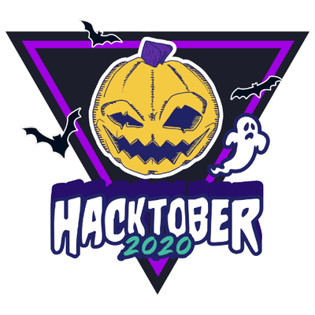

### Hey there, welcome to my github profile :pray::pray::pray:
Basically I work as a **Linux System Administrator** , hustle as a **Developer**. My interests are:
- Backend Development :v:
- CTF (Newbie) :mega:
- Hack The Box (beginner) :bulb:
---

### Path to open source

Recently I've decided to join open source, trying to contribute to the world. I'm not a heavy maintainer or builder, but I try to be one. Currently I'm developing my own network DoS detector.

 
 
 

---

### Languages & Frameworks
- Python
- PHP
- Shell Scripting
- C
- Flask, Django
- Laravel
- ReactJS
