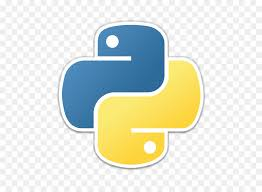

### Hey there, welcome to my github profile :pray::pray::pray:
Basically I work as a **Linux System Administrator** , hustle as a **Developer**. My interests are:
- Backend Development :v:
- CTF (Newbie) :mega:
- Hack The Box (beginner) :bulb:
---

	

### Path to open source
Recently I've decided to join open source, trying to contribute to the world. I'm not a heavy maintainer or builder, but I try to be one \
---

### Languages & Frameworks

<!--
**naiame-neltheri/naiame-neltheri** is a ✨ _special_ ✨ repository because its `README.md` (this file) appears on your GitHub profile.

Here are some ideas to get you started:

- 🔭 I’m currently working on ...
- 🌱 I’m currently learning ...
- 👯 I’m looking to collaborate on ...
- 🤔 I’m looking for help with ...
- 💬 Ask me about ...
- 📫 How to reach me: ...
- 😄 Pronouns: ...
- ⚡ Fun fact: ...
-->
